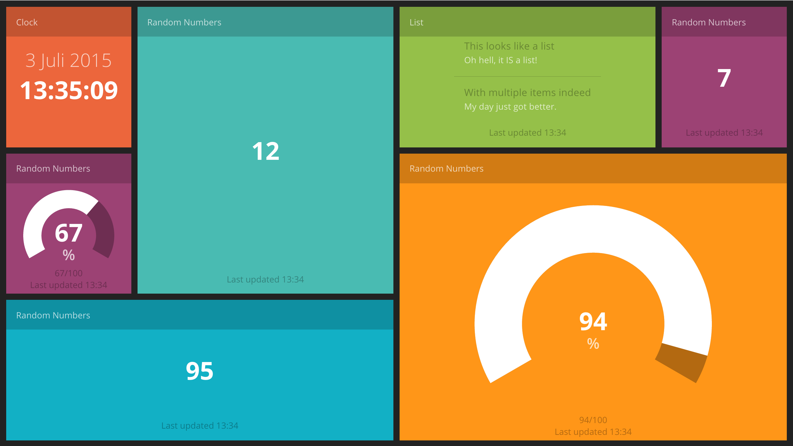

# smarttv-angular-dashboard

> A dashing.io-like angular based dashboard for smarttvs.

A web-app that polls for services via angular.

## Installation

Download the latest release and install dependencies.

    npm install

## Demo

Doubleclick on demo.html or open it in your favorite browser.

## Usage

## Creating your own dashboard

Copy demo.html and rename it to index.html. 

### Tiles

The layout is based on angular-material. more specific: the md-grid-list directive. The grid-list is set to be exactly 6 columns and 3 rows on a 1280x720 screen.

To make a new tile just add the following html:

    <md-grid-tile></md-grid-tile>

By default it will have no color and is 1x1 big. By adding attributes `md-rowspan` and `md-colspan`, the tile can be sized just like a html table uses `rowspan` and `colspan`. There are a few color classes that resemble the color of the dashing.io dashboard.

For example:

    <md-grid-tile md-rowspan="1" md-colspan="1"></md-grid-tile>

is the equivalent of a normal tile.

    <md-grid-tile md-rowspan="1" md-colspan="3" class="orange"></md-grid-tile>

will be orange, 3 tiles wide and 1 tile high.

    <md-grid-tile md-rowspan="2" md-colspan="2" class="green"></md-grid-tile>

will be a green square, double the size of a normal tile.

### Widgets

In a tile you can specify a widget with the `ng-widget` directive. Specify a widget controller by using the `widget-id` attribute

Example:

    <ng-widget widget-id="mycontrollername"></ng-widget>

Insert a widget script at the bottom of the page, right after the `<!-- widgets -->` comment and before the `<!-- endbuild -->` comment.

        <!-- widgets -->
        

    <!-- endbuild -->

#### Creating a widget

The code for making a widget is as follows

    (function(window, angular, undefined){
        
        'use strict';

        /**
         * Add a new controller to the dashboard module
         * add the dependency $scope
         */
        angular
            .module('dashboard')
            .controller('mycontrollername', ['$scope', controller]);

        /**
         * @function controller
         * @private
         */
        function controller($scope){

            $scope.title = 'My first Widget';
            $scope.data = '1337';
            $scope.status = 'Such wow';
        }

    })(window, window.angular);

The widget can be personalized with the following variables.

$scope.header = TRUE;
$scope.footer = TRUE;
$scope.title = 'Widget Title';
$scope.widgetType = '';
$scope.status = '';
$scope.lastUpdated = '';

## Widget Types

### value

Shows a value.

update(data) where data is a string

    $scope.update('52');

### list

Shows a list.

update(data) where data is an object with keys `description` and `value`.

    $scope.update({
        'description': 'This will be the title',
        'value': 'A larger text for the content.'
    });

### percentage

Shows a visual representation of a percentage.

update(data) where data is an object with keys `value` and `total`.

    $scope.update({
        'value': 10,
        'total': 24
    });

### image

Shows an image

update(data) where data is a URL of an image

    $scope.update('https://placekitten.com/g/200/300');

### clock

Shows the current date and time

    <md-grid-tile>
        <ng-widget widget-id="clock" class="red"></ng-widget>
    </md-grid-tile>